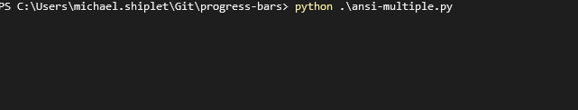

# progress bars
This contains three files that give different approaches to building a command-line progress bar in python.

---

### `carriage-return.py`

This utilizes the "carriage return" approach, which amounts to rewriting a single, formatted string and prepending the string with the `\r` character. 
This is great if you only need to update a single progress bar.

---

### `ansi.py`

This utilizes ANSI escape codes, specifically those around cursor position. 
The practice can be simplified to "for every update to the line, send the cursor to the left by the number of columns present in the current tty/terminal".

---

### `ansi-multiple.py`

This also utilizes ANSI escape codes, but also includes moving the cursor _up_ and to the left. 
This enables multiple progress bars, for use in multithreaded applications.

---

### When running on Windows CMD or Powershell
If you're using Windows 10 (post 2017) and the ANSI solutions don't work, you need to re-enable ANSI support for your command prompts. 
To do that, open up your Registry Editor and make the following changes:
- navigate to HKEY_CURRENT_USER \ Console
- add a new DWORD 32 bit value
- name the value `VirtualTerminalLevel`
- modify the value to 1 (hex)
- reboot
    - if you edit this value after rebooting, you can close & reopen the prompts for the changes to take effect
- profit!!!
- [this github issue](https://github.com/ytdl-org/youtube-dl/issues/15758) has some images to follow as well

The ANSI solutions will also work out-of-the-box on Windows Subsystem for Linux terminals, 
and the new [Windows Terminal (currently in preview)](https://www.microsoft.com/en-us/p/windows-terminal-preview/9n0dx20hk701?activetab=pivot:overviewtab)
